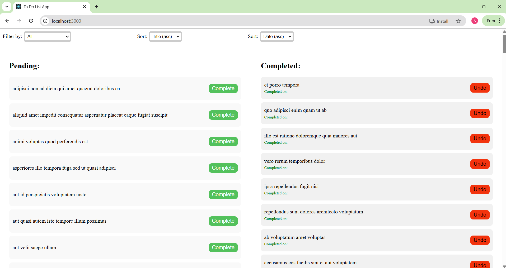

# Getting Started with Create React App

This project was bootstrapped with [Create React App](https://github.com/facebook/create-react-app).

## Available Scripts

In the project directory, you can run:

### `npm start`

Runs the app in the development mode.\
Open [http://localhost:3000](http://localhost:3000) to view it in your browser.

The page will reload when you make changes.\
You may also see any lint errors in the console.

Technologies Used:
React
HTML
CSS
JavaScript
Screenshot:

# Todo App
This is a simple React Todo app that allows users to manage pending and completed tasks.  
Users can filter, sort, complete, and undo todos.
- Node.js = 22.15.0
- npm = 9.0.0 

cd to-do-list
npm start
